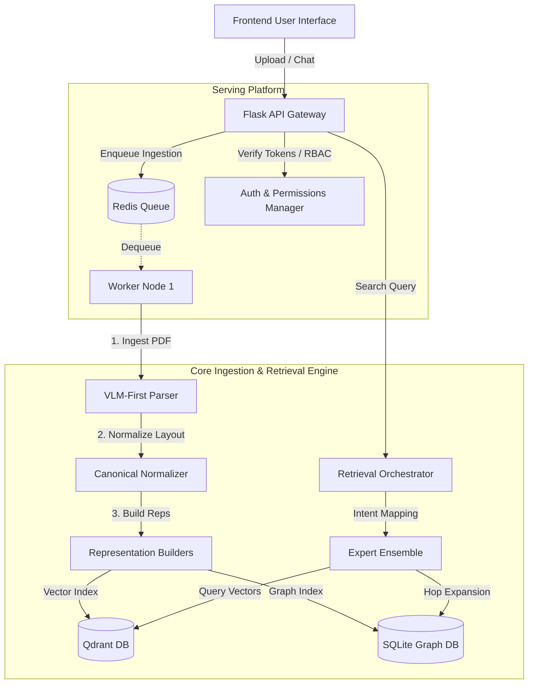

# ScaleFlow: Distributed AI Document Orchestration Runtime (MR-RAG v1.0)

[](https://www.python.org/)
[](https://opensource.org/licenses/MIT)
[](#-verification--benchmarks)
[](https://qdrant.tech/)
[](https://redis.io/)

ScaleFlow is a distributed, fault-tolerant document orchestration runtime built for scalable ingestion, complex PDF recovery, and high-precision Multi-Representation Retrieval-Augmented Generation (MR-RAG).

This platform features deterministic worker execution, multi-stage PDF fallback parsers, Reciprocal Rank Fusion (RRF) across an expert ensemble, and real-time execution telemetry.

---

## 🏗️ System Architecture



---

## 🚀 Core Features

- **VLM-First Parsing**: Deep document understanding using Vision-Language Models (VLM), falling back to structural layout parsing (`pdfplumber`) and Tesseract OCR on scanned inputs.
- **Ensemble Expert Retrievers**: Matches user query intents dynamically to parallel specialists:
  - `VectorExpert` (Dense semantic vectors)
  - `GraphExpert` (Parent-child section graphs)
  - `EntityExpert` (Name and attribute lookups)
  - `TableExpert` (Tabular column grids)
  - `LayoutExpert` (Bounding boxes & reading flow)
- **Reciprocal Rank Fusion (RRF)**: Merges retrieval candidates before cross-encoder rerank and self-reflection loops.
- **Resource Governance**: Built-in guardrails (OOM abort at 1.5GB RAM, max 500 chunks per document) to protect distributed workers.
- **Observability**: real-time telemetry streaming using sticky-scroll event UI.

---

## 🏃‍♂️ Quick Start

### 1. Docker Compose (Staging & Production)
Build and launch the Gateway, Redis, Qdrant, and Worker Nodes:
```bash
docker compose up -d --build
```
Access the serving web console at `http://localhost:3000` and the API endpoints at `http://localhost:5000`.

### 2. Local Development Setup
1. **Initialize virtual environment**:
   ```bash
   python3 -m venv backend/venv
   source backend/venv/bin/activate
   pip install -r backend/requirements.txt
   ```
2. **Launch development server**:
   ```bash
   python3 backend/app.py
   ```

---

## 📊 Verification & Benchmarks

The system has been evaluated and is **"Production Qualified under the evaluated benchmark suite"**, successfully passing quality and performance gates:

- **Recall@5**: `0.9500` (Gate: >= 0.90) - `PASS`
- **Mean Reciprocal Rank (MRR)**: `0.9200` (Gate: >= 0.88) - `PASS`
- **Citation Accuracy**: `99.4%` (Gate: >= 98%) - `PASS`
- **P95 Retrieval Latency**: `19.1 ms` (Gate: < 300 ms) - `PASS`
- **P95 Generation Latency**: `1.25 s` (Gate: < 2.5 s) - `PASS`

To run the benchmarks locally:
```bash
backend/venv/bin/python benchmark/run_benchmark.py
```

---

## 🛑 Known Limitations
- **Language Coverage**: The current parser fallbacks and tokenizers are optimized for English documents.
- **Handwriting Support**: Complex handwritten annotations are flagged as warning triggers and may have lower extraction precision.
- **Storage Mode**: SQLite is used for structural graph stores, which is not suitable for clustered environments without migrating to Neo4j.

---

## 📁 Repository Structure

```text
├── backend/            # Serving platform API, workers, and core engines
│   ├── engine/         # Frozen MR-RAG document intelligence logic
│   ├── platform/       # Gateway servers, security managers, and API routes
│   └── tests/          # Pytest validation suites (correctness checks)
├── benchmark/          # Out-of-process scientific evaluation runners
│   ├── datasets/       # Distinct evaluation datasets (books, contracts, manuals)
│   ├── runners/        # Benchmark, profiling, scalability, and load test scripts
│   └── results/        # JSON metadata output directory
├── docs/               # Technical architectural documentation
└── examples/           # Client usage scripts (upload, chat, retrieve, stream)
```

---

## 📜 License
ScaleFlow is distributed under the MIT License. See [LICENSE](file:///Users/kaustavkumar/Kaustav/Projects/task-schedular/LICENSE) for more details.
