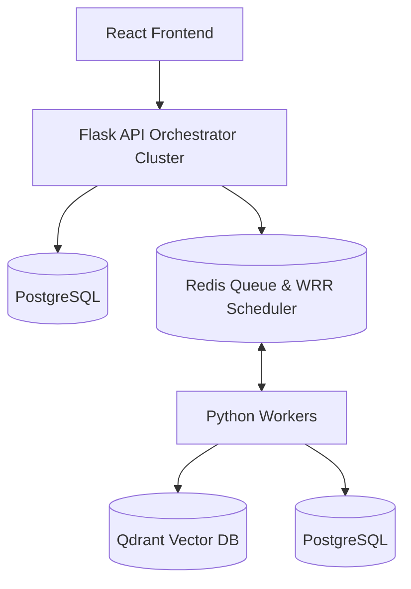
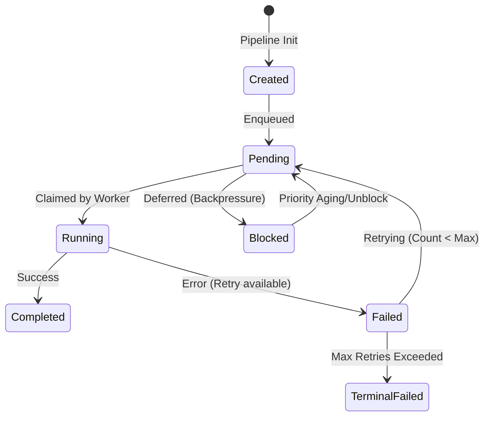

# ScaleFlow Platform Architecture Documentation

ScaleFlow is a high-throughput, fault-tolerant document ingestion, processing, and semantic search platform. It uses a decoupled worker-orchestrator architecture with active-active clustering, event sourcing, Redis priority scheduling, and hybrid Qdrant vector retrieval.

---

## 1. System Components Overview

### 1.1. Frontend
* **Technology**: React (SPA), Tailwind CSS/Vanilla CSS, React-Router.
* **Responsibilities**: Provides dashboards to upload files, monitor real-time worker heartbeats, inspect task logs, view interactive pipeline DAG nodes, and trigger semantic search queries.

### 1.2. Orchestrator
* **Technology**: Flask API (Python), Waitress WSGI.
* **Responsibilities**: 
  - DAG Builder: Builds task dependency graphs for document ingestion pipelines (`parse_document` → `validate_parse_quality` → `chunk_text` → `generate_embeddings`).
  - Active-Active Clustering & Leader Election: Maintains scheduler high-availability. Multiple orchestrator instances run concurrently; database leases determine a leader to execute recovery and priority scanner scans.
  - Event Sourcing: Records all changes in state as immutable events in the PostgreSQL database.

### 1.3. Redis
* **Responsibilities**: 
  - Distributed Priority Queue: Schedules tasks in capability-specific queues (e.g., `task_queue_test_cpu_heavy_high`, `task_queue_embedding_gpu_medium`).
  - Weighted Round-Robin (WRR): Fair task scheduling between high, medium, and low priority tasks to prevent queue starvation.
  - Leases and Heartbeats: Holds active leases for worker tasks. If a worker heartbeats cease, the lease expires, and the orchestrator sweeps the task back to pending.

### 1.4. PostgreSQL Database
* **Responsibilities**:
  - Relational Schema: Stores persistent pipeline tables, task state fields, log audit trails, registered artifacts metadata, and event sourcing records.
  - Database Transactions: Performs atomicity guarantees for claim, completion, and recovery tasks.

### 1.5. Workers
* **Responsibilities**:
  - Multi-Threaded Task Consumer: Claims and executes tasks based on capability capabilities.
  - Heartbeat & Lease Renewals: Spawns background threads to renew task leases during active processing.
  - Service Integration: Coordinates parsing, quality gate validation, chunking, and embedding creation.

### 1.6. Qdrant
* **Responsibilities**:
  - Vector Storage: Stores dense sentence-transformer vectors (dimension 384) in the `scaleflow_chunks` collection.
  - Scoped Retrieval: Filters searches using payload attributes (e.g., `pipeline_id` or `file_id`).

---

## 2. Lifecycles

### 2.1. Task Lifecycle

1. **Created**: Task metadata is saved in PostgreSQL during pipeline generation.
2. **Pending**: Task ID is pushed to the Redis priority queues.
3. **Running**: Worker pops the task ID, registers its lease token, and updates PostgreSQL.
4. **Blocked**: System overload backpressure defers the task, placing it in a blocked queue.
5. **Completed**: Task produces artifacts, completing successfully.
6. **Failed**: Exceptions cause task failure; if retry count is less than max, it goes back to pending.

### 2.2. Artifact Lifecycle

* **Uploaded File**: Saved to local storage disk (`storage/uploads/`).
* **Parsed Text**: Clean text extracted by pypdf/pdfplumber fallback chain.
* **Text Chunks**: Sentence-boundary-preserving paragraphs.
* **Vector Index**: 384-dimension vectors loaded into Qdrant.
* **Summary**: Standard extractive paragraph summary generated from the vectors.

### 2.3. Worker Lifecycle
1. **Registration**: Worker registers its capabilities (`cpu_heavy`, `embedding_gpu`) in the database.
2. **Polling**: Checks capability-matching queues in Redis using Weighted Round-Robin (WRR) scheduling.
3. **Execution**: Spawns a execution thread and starts a background thread to send heartbeats.
4. **Heartbeat**: Sends worker statistics every 10 seconds.
5. **Deregistration**: On clean shutdown, sets status to offline.

### 2.4. Retrieval Lifecycle
1. **Embed Query**: Dense vector query generated via embedding service.
2. **Search Qdrant**: Queries Qdrant collection scoped by `pipeline_id` filter using Cosine similarity.
3. **Filter Scores**: Discards chunks below `MIN_RETRIEVAL_SCORE` (except when no results pass, falling back to top chunks).
4. **Answer Report**: Extends hits into extractive answers, maps citations, and estimates query confidence.
