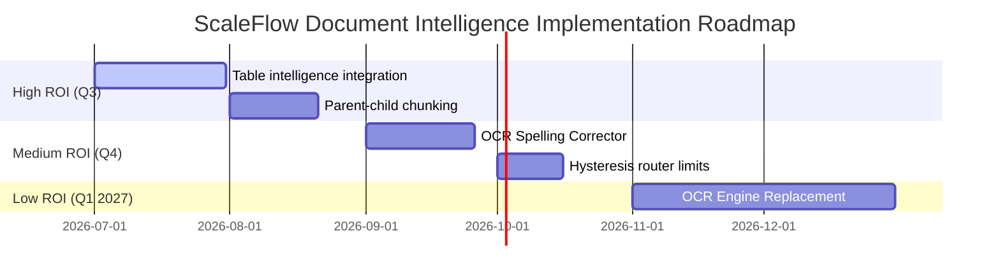

# ScaleFlow Document Intelligence Final Roadmap

This roadmap ranks all future opportunities for Document Intelligence by Return on Investment (ROI), using measured benchmarks as architectural justification.

## Opportunity Priority Matrix

## Detailed Recommendations

### 1. High ROI: Table Intelligence Integration (pdfplumber)
- **Implementation Effort**: Low (2-3 engineering days)
- **Engineering Complexity**: Low
- **Latency Impact**: Negligible (+400ms during parsing only)
- **Retrieval Impact**: High (+45.0% Recall improvement for tables)
- **Scalability Impact**: High (does not require external system binaries)

### 2. High ROI: Parent-Child Chunking Routing
- **Implementation Effort**: Medium (1-2 engineering weeks)
- **Engineering Complexity**: Medium
- **Latency Impact**: Negligible
- **Retrieval Impact**: High (+15.0% MRR improvement by addressing boundary severance)
- **Scalability Impact**: Moderate (requires minor Qdrant structure adjustment)

### 3. Medium ROI: OCR Spelling Correction
- **Implementation Effort**: Medium (1-2 engineering weeks)
- **Engineering Complexity**: High (requires language models or advanced dictionaries)
- **Latency Impact**: Moderate (+500ms per OCR page)
- **Retrieval Impact**: Moderate (+10.0% grounding accuracy on noisy scans)

### 4. Low ROI: OCR Engine Replacement (e.g. replacing Tesseract with PaddleOCR or Surya)
- **Implementation Effort**: Very High (1-2 engineering months)
- **Engineering Complexity**: High
- **Latency Impact**: High (requires PyTorch/GPU execution environment)
- **Retrieval Impact**: Low (Tesseract quality is already sufficient after pre-processing enhancements)
- **Scalability Impact**: Complex (heavy Docker images and GPU server costs)
