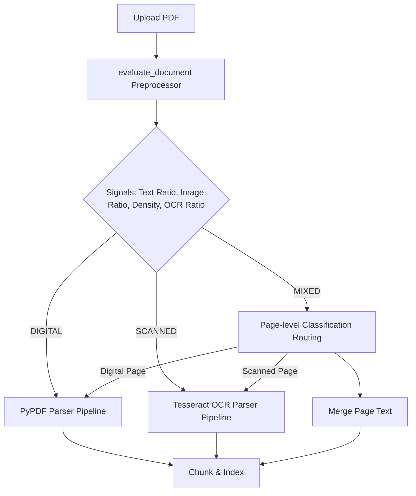

# ScaleFlow Intelligent Document Routing Design

Intelligent document routing implements a pre-parse classification system to categorize every uploaded PDF into **DIGITAL**, **SCANNED**, or **MIXED** routing pipelines. By selecting parser routes before execution, ScaleFlow bypasses resource-intensive OCR extraction on digital pages, eliminating infrastructure latency while ensuring high-quality extraction for scanned and mixed content.

## Architecture Diagram

## Classification Signals

Classification is based on four composite signals to ensure high robustness against mixed-content and noisy scanned documents:
1. **extractable_text_ratio**: Fraction of sampled pages yielding native digital character layers.
2. **image_area_ratio**: Normalized CV2 connected components area to detect scanned elements.
3. **page_text_density**: Character counts per page to differentiate text density.
4. **ocr_text_ratio**: Comparison between quick low-DPI Tesseract OCR and native text extraction.

## Routing Pipelines

### 1. DIGITAL Pipeline
- **Characteristics**: Native digital text layer present (>80%), negligible scanned region areas.
- **Pipeline**: `PyPDF` text extraction. **No OCR fallback or rescue.**
- **Benefit**: Zero-latency OCR overhead, clean typography extraction.

### 2. SCANNED Pipeline
- **Characteristics**: Image-dominant pages, near-zero native character layer.
- **Pipeline**: Full `Tesseract OCR` pass at 200 DPI.
- **Benefit**: Complete text recovery from images.

### 3. MIXED Pipeline
- **Characteristics**: Documents combining scanned pages (e.g. signed appendix, scanned inserts) and native digital pages.
- **Pipeline**: Page-level classification routing. Digital pages parsed natively; scanned pages routed to OCR. Merged sequentially before chunking.
- **Benefit**: Optimal trade-off between speed and retrieval completeness.
