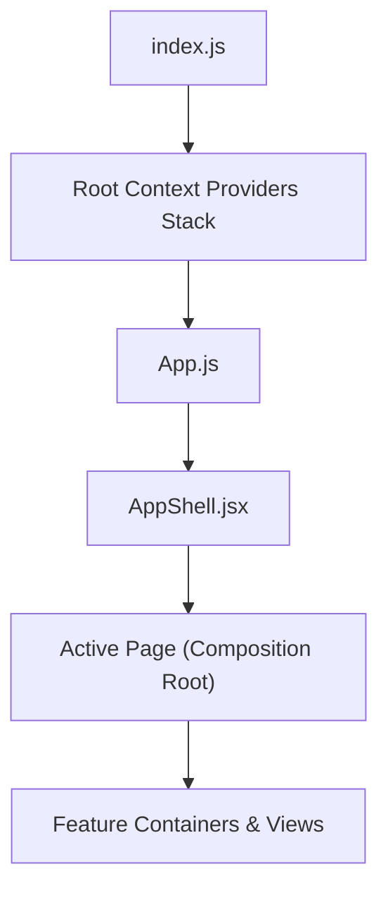
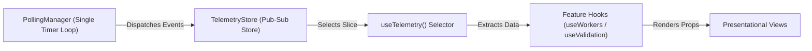

# ScaleFlow Frontend Architecture Specification

This document details the frontend architecture for the ScaleFlow Distributed Execution platform. It serves as an onboarding guide and structural reference for engineering updates.

---

## 1. Project Directory Structure

```text
src/
├── components/          # React Presentation & Composition Layer
│   ├── layout/          # Application shell, navigation structure
│   ├── ui/              # Reusable atomic design-system library
│   ├── validation/      # Chaos & validation centers features
│   ├── workers/         # Worker node registry views
│   └── workspace/       # AI document workspace views
├── contexts/            # Global/Shared React State Contexts
├── hooks/               # Shared interaction hooks
├── services/            # API clients & Telemetry data layers
├── routes/              # Route configs
└── styles/              # Design tokens and responsive CSS variables
```

---

## 2. Application Startup & Flow



### Flow Responsibilities:
1. **Providers Stack:** Wraps the render tree with Theme, Document, Pipeline, Notification, and Workspace state containers.
2. **App.js:** Serves as the composition root, managing route switches, Error Boundaries, and `<CommandPalette>` overlays.
3. **AppShell:** Handles application frames (sidebar navigations, header topbars, and live infrastructure indicators).

---

## 3. Centralized Telemetry & Polling Pipeline

ScaleFlow enforces a **single-interval polling architecture** to avoid thread congestion.



### Key Rationale:
- **Zero Parallel Loops:** Pages do not instantiate their own `setInterval` loops. Telemetry events flow into the `TelemetryStore`, which components subscribe to selectively.

---

## 4. Architectural Decision Records (ADRs)

### ADR-1: Centralized Polling Manager
- **Context:** Multiple pages polling the broker backend independently lead to network congestion and duplicate renderings.
- **Decision:** Consolidate all polling schedules into one worker timer that dispatches telemetry slices to a central store.

### ADR-2: Context + Hooks vs. Redux
- **Context:** Managing workspace selection and notifications requires sharing state across directories.
- **Decision:** Leverage React Context Providers for low-frequency global settings (theme, selection IDs), and a custom pub-sub TelemetryStore for high-frequency updates to keep state changes isolated and lightweight.

### ADR-3: Container / Presenter Split
- **Context:** Mixing API triggers with rendering markup inflates component files (e.g. legacy `OverviewPage.js` reached 1,300 lines).
- **Decision:** Split features into custom hooks (behavior/API), composition roots (layout), and presenter views (presentation only).
