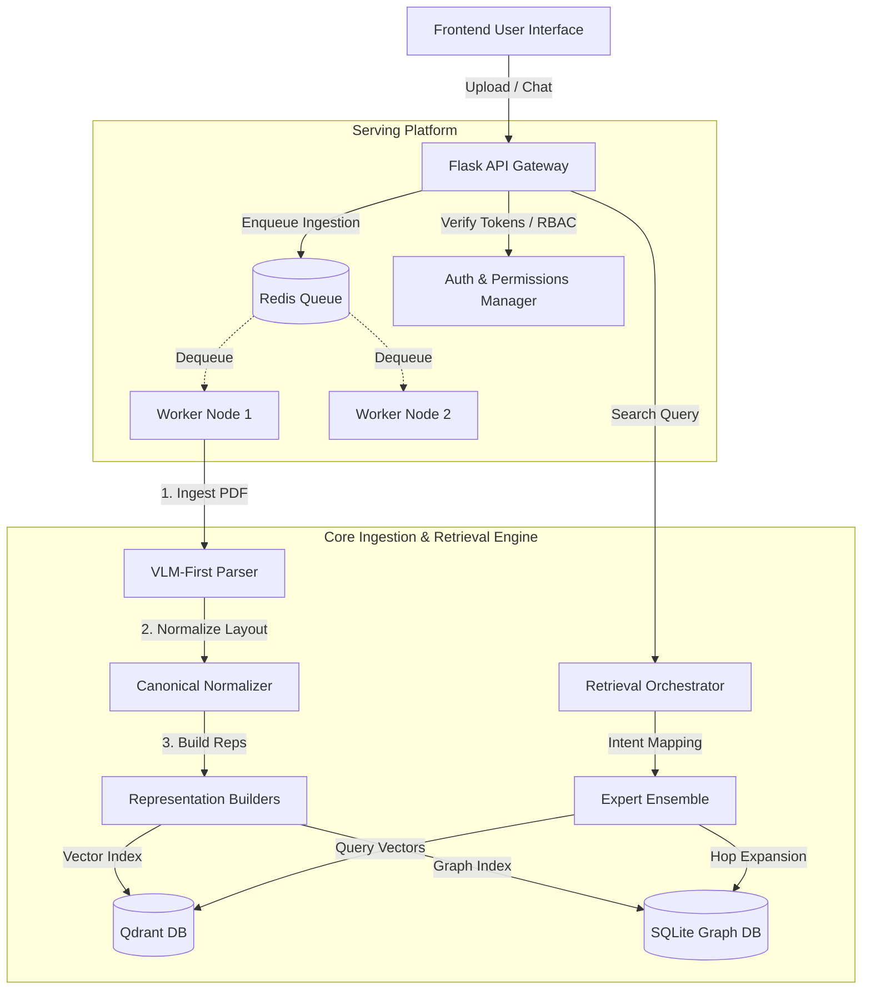
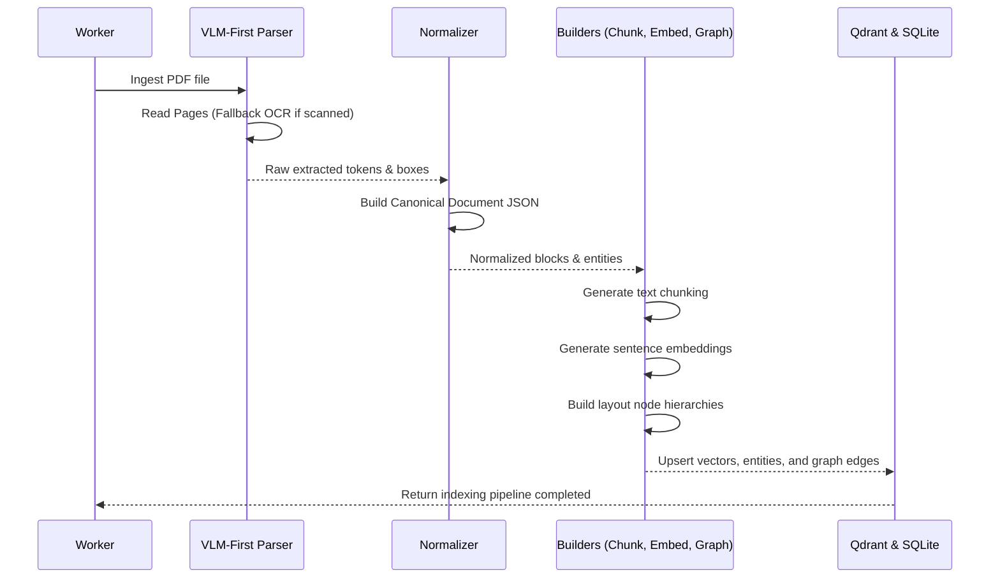
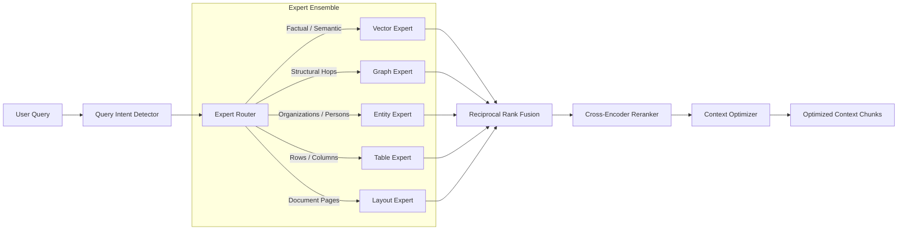

# Architecture Overview (MR-RAG v1.0)

This document outlines the high-level system architecture, subsystems, data flow, and pipeline stages of the ScaleFlow MR-RAG platform.

## High-Level System Architecture

The system splits cleanly into three primary conceptual layers:
1. **MR-RAG Ingestion & Extraction Engine**: The frozen core processing documents into canonical formats, extracting layout graphs, vectorizing representations, and updating vector databases.
2. **Serving & Platform Layer**: Provides Flask API gateways, authentication handlers, rate limiters, Redis task brokers, and task execution worker nodes.
3. **Evaluation & Benchmarking Framework**: Out-of-process suite validating retrieval quality, system latencies, and scalability gates.

---

## Indexing & Processing Pipeline

The indexing pipeline takes a raw PDF document and constructs its multi-representation layout:

---

## Retrieval Pipeline

The retrieval orchestrator routes queries dynamically to parallel experts:

This ensures that the system is **Production Qualified under the evaluated benchmark suite**.
