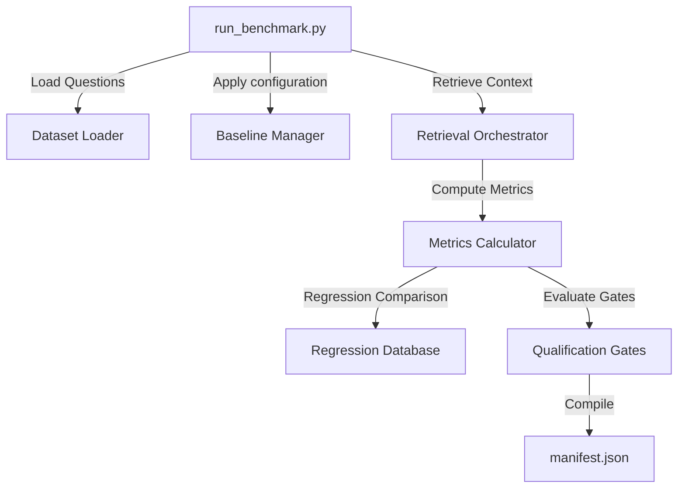

# Evaluation & Validation Framework (MR-RAG v1.0)

This document details the components and gates comprising the MR-RAG out-of-process evaluation framework.

## Subsystem Block Structure

---

## 1. Metric Calculations & Classifications
- **Evaluation Runner**: Queries datasets in `benchmark/datasets/` across different baselines.
- **Metrics Calculator**: Computes Recall, Precision, MRR, NDCG, EM, F1, and Citation Accuracy.
- **Hallucination & Failure Classifier**: Identifies missing chunks, wrong entity names, citation discrepancies, and fabricated relationships.

---

## 2. Regression & Gate Checks
- **Regression DB**: Stores previous benchmark runs inside `benchmark/regression/baselines.json` to flag version regression.
- **Gates Check**: Asserts the minimum quality and latency thresholds required to mark a release as **Production Qualified under the evaluated benchmark suite**.
