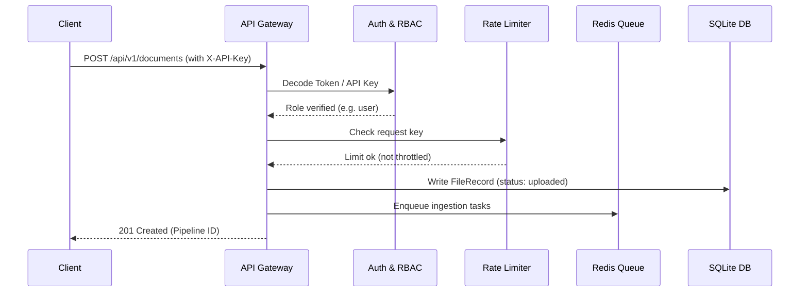

# Inference Gateway Specification (MR-RAG v1.0)

This document describes the API Gateway layer, request validation flow, rate limiting, and security rules.

## Request Lifecycle Flow

Every HTTP request to the serving platform passes through the security and routing filters before reaching task handlers:

---

## Rate Limiting & Auth Schemes
- **Authentication**: Key-based (`X-API-Key`) or JWT token headers (`Authorization: Bearer <token>`).
- **RBAC**: Handled by `PermissionManager` to check permission scopes (`read:document`, `delete:document`, `admin:actions`).
- **Rate Limiting**: Sliding-window rate limiter stores requests count inside Redis, capping client IP to configured limits (e.g., max 100 requests per minute).

This ensures platform protection, contributing to a system **Production Qualified under the evaluated benchmark suite**.
