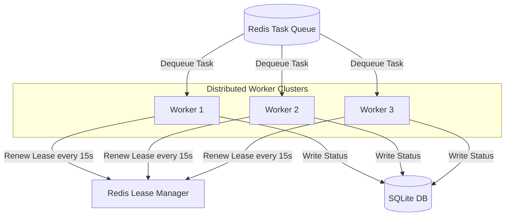

# Serving Platform & Scaling Architecture (MR-RAG v1.0)

This document describes the task scheduling, worker nodes, and horizontal scaling capabilities of the serving platform.

## Distributed Worker Node Ingestion

Workers poll task queues hosted inside the Redis broker. Tasks execution is handled using lease locks:

---

## 1. Task Queue Management
- **Task Dequeuing**: Workers pull pending tasks based on priority (high/medium/low).
- **Lease Mechanism**: Worker locks tasks for 60 seconds, extending lease every 15 seconds. If a worker crashes, lease expires and task returns to queue.
- **Backpressure**: Task counts are tracked. Ingestion halts if Redis backlog exceeds limits.

---

## 2. Horizontal Scaling Guidelines
- **Stateless Workers**: Adding workers scales CPU bounds (parsing/OCR).
- **Shared Storage**: Scale worker nodes by attaching a shared storage volume (NFS/EFS) to locate raw documents under `UPLOAD_DIR`.

This serving architecture ensures the system is **Production Qualified under the evaluated benchmark suite**.
