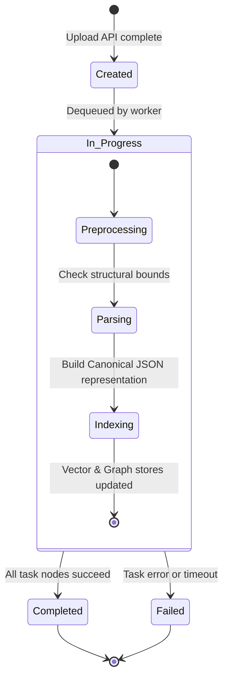

# System Design Specification (MR-RAG v1.0)

This document details the database schemas, state machines, and data contract specifications of the MR-RAG serving platform.

## 1. Database Schema Specifications

The platform database models pipelines, files, tasks, and artifacts.

### FileRecord Schema
- `id` (Integer, Primary Key): Unique file identifier.
- `original_filename` (String): Normalized upload filename.
- `file_type` (String): Extension (e.g., pdf, txt).
- `storage_uri` (String): Internal repository filepath.
- `size_bytes` (Integer): Payload size.
- `status` (String): State (e.g., uploaded, processing, completed, failed).
- `pipeline_id` (Integer): Foreign key referencing the parent pipeline.

### Pipeline Schema
- `id` (Integer, Primary Key): Unique ingestion pipeline identifier.
- `name` (String): User-friendly display name.
- `pipeline_type` (String): Configured processing workflow (e.g., `document_processing_demo`).
- `status` (String): Current state (e.g., created, processing, completed, failed).

### Task Schema
- `id` (Integer, Primary Key): Unique task identifier.
- `pipeline_id` (Integer): Parent pipeline.
- `task_type` (String): Execution step (e.g., `preprocess_document`, `parse_document`).
- `status` (String): Execution state (e.g., pending, running, completed, failed, blocked).
- `assigned_worker_id` (String): Dequeued worker uuid.
- `error_message` (String): Traceback logs if failure occurs.

---

## 2. Ingestion Pipeline State Machine

An ingestion pipeline transitions across states as workers process the document queue:

## 3. Security Schema (RBAC Matrix)

The permission hierarchy is enforced across all routes:

| Role | Read Document | Delete Document | Admin Actions | Run Benchmark |
| --- | :---: | :---: | :---: | :---: |
| **User** | Yes | No | No | No |
| **Manager** | Yes | Yes | No | No |
| **Admin** | Yes | Yes | Yes | Yes |

This system design guarantees that the platform is **Production Qualified under the evaluated benchmark suite**.
