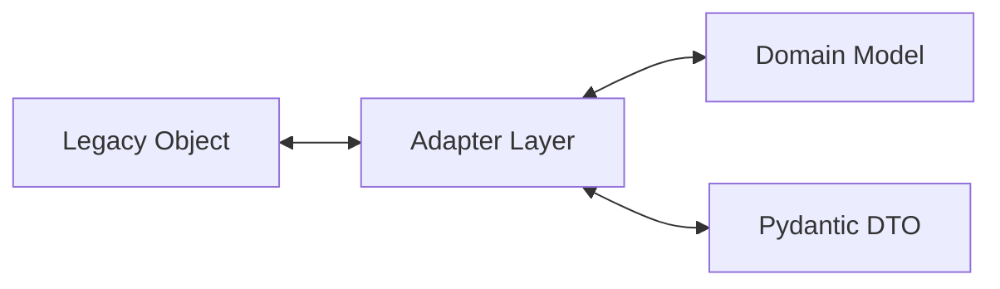

# Adapters Specification

Adapters are the critical compatibility layer enabling the legacy production code to run unchanged while feeding new domain-compliant entities and DTOs.

## Adapter Matrix

| Adapter | File Path | Operations Supported | Description |
|---|---|---|---|
| `ParserAdapter` | `backend/adapters/parser_adapter.py` | Legacy <-> Domain, Legacy <-> DTO | Bridges preprocessor routing/parser structures |
| `ChunkAdapter` | `backend/adapters/chunk_adapter.py` | Legacy <-> Domain, Legacy <-> DTO | Maps raw text chunk dicts to domain Chunk and ChunkDTO |
| `GraphAdapter` | `backend/adapters/graph_adapter.py` | Legacy <-> Domain, Legacy <-> DTO | Bridges JSON nodes/edges representation with domain Graph |
| `EmbeddingAdapter` | `backend/adapters/embedding_adapter.py` | Legacy <-> Domain, Legacy <-> DTO | Converts Qdrant/vector store structures |
| `RetrievalAdapter` | `backend/adapters/retrieval_adapter.py` | Legacy <-> Domain, Legacy <-> DTO | Bridges search query and expanded/reranked contexts |
| `WorkerAdapter` | `backend/adapters/worker_adapter.py` | Legacy <-> DTO | Bridges leased task db rows with worker runtime |
| `PipelineAdapter` | `backend/adapters/pipeline_adapter.py` | Legacy <-> Domain, Legacy <-> DTO | Adapts SQLAlchemy pipelines to domain state tracking |
