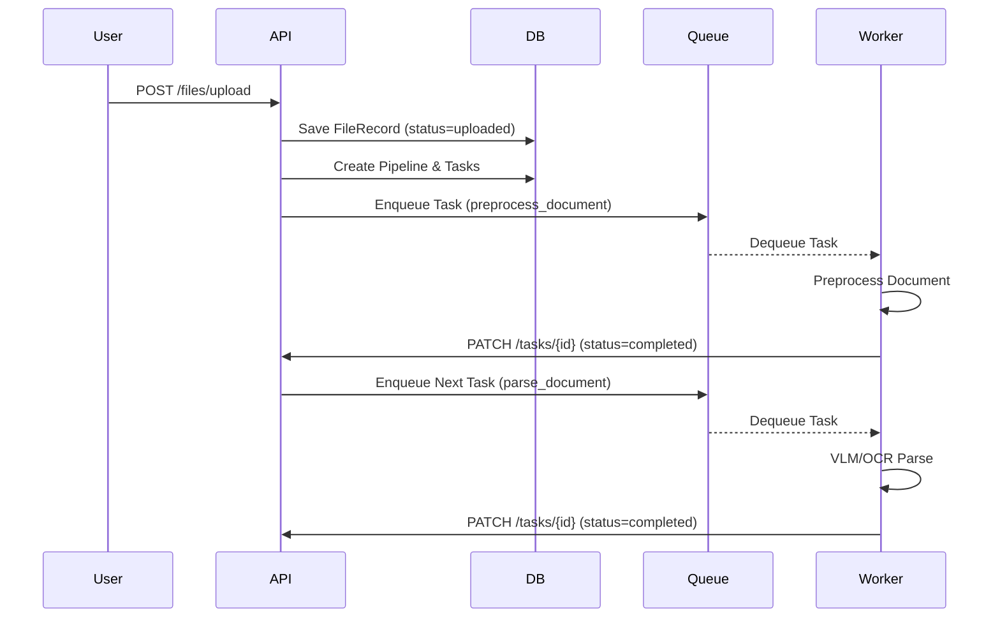

# Call Flow Sequence Diagrams

## Document Processing Sequence



## Query & Retrieval Sequence

```mermaid
sequenceDiagram
    participant User
    participant API
    participant VectorStore
    participant Reranker
    
    User->>API: POST /search
    API->>VectorStore: Search Dense Embeddings
    API->>API: Local BM25 Search
    API->>API: Merge Dense + Sparse Scores
    API->>API: Graph Expansion (find neighbors)
    API->>Reranker: Cross-Encoder Score
    Reranker-->>API: Reranked list
    API-->>User: Search Results
```\n