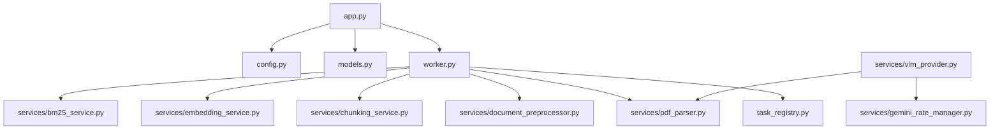

# Dependency Report

This report analyzes import couplings, cyclic paths, and service architectures.

## Coupling Analysis

## Identified Cyclic / Tight Couplings
- **`app.py` & `worker.py`**: Mutual dependencies on initialization pathways.
- **`services/vlm_provider.py` & `services/pdf_parser.py`**: Bidirectional logic around layout text/scans.
- **Global State**: Singletons in `vlm_provider`, `embedding_service`, and `gemini_rate_manager` retain API tokens and network sessions in global variables.\n