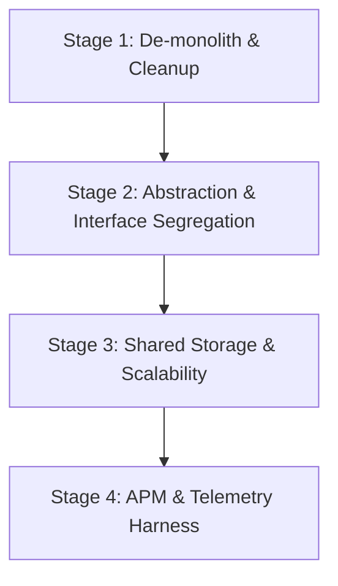

# Master Refactor Plan

This plan maps all technical debt and refactoring tasks across future stages to establish a clean, production-ready architecture.

## Refactoring Roadmaps by Priority

### Priority 1: De-monolith core files (Stage 1)
- **Task**: Split `backend/app.py` into separate blueprint routers (`/tasks`, `/pipelines`, `/workers`).
- **Dependencies**: None.
- **Goal**: Minimize regression risk by isolating Flask routing.

### Priority 2: Consolidate duplicates (Stage 1)
- **Task**: Delete root-level `document_preprocessor.py` and point all scripts to `backend/services/document_preprocessor.py`.
- **Dependencies**: Priority 1.
- **Goal**: Prevent drift in image enhancement logic.

### Priority 3: Isolate DB Configuration (Stage 1)
- **Task**: Extract DB initialization and dialect selections out of `models.py` to prevent import-time side effects.
- **Dependencies**: None.

### Priority 4: Abstract External Interfaces (Stage 2)
- **Task**: Wrap embedding and VLM services in abstract classes to adhere to DIP.
- **Dependencies**: Priority 1.

### Priority 5: Centralize Index Storage & Deploy Telemetry (Stage 3 & 4)
- **Task**: Set up open-telemetry instrumentation to accurately track latencies and memory usage in live runs.
- **Dependencies**: Priority 1 & 4.
