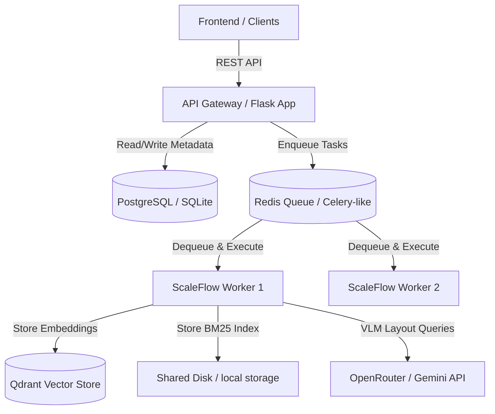

# ScaleFlow Overview

ScaleFlow is a distributed, agentic AI document intelligence and processing platform. It ingests complex, large-scale multi-format files (PDFs, images), conducts image enhancements, parses the text via multi-tiered OCR/VLM layout engines, extracts hierarchical Document Graphs, chunks the text semantically, generates vectors, indexes via sparse BM25, and provides hybrid retrieval (dense + sparse + graph expansion + reranking) for downstream LLM answering.

## System Architecture

## System Deployment Model
- **Frontend**: React-based single-page application.
- **Backend (API)**: Flask-based REST service with SQLAlchemy connection pooling.
- **Workers**: Concurrency-managed Python worker processes executing tasks via capabilities.
- **Queue/Broker**: Redis instance handling task queues, priorities, lease timeouts, and heartbeats.
- **Databases**: PostgreSQL (fallback to SQLite) for metadata and transaction audit trail; Qdrant for semantic vector representation.\n