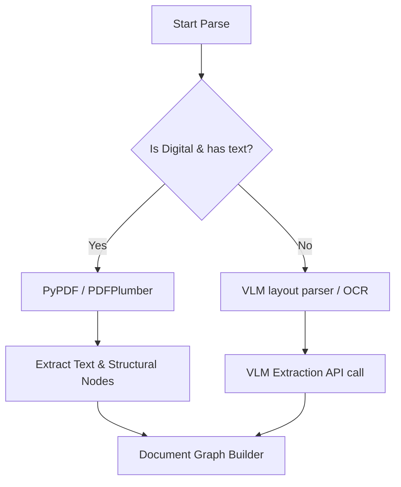

# Parser Architecture

ScaleFlow uses a multi-tier fallback parsing layout to process digital and scanned documents.

## Parser Fallback & Hierarchy
1. **PyPDF / PDFPlumber**: Primary tier for digital documents with indexable character maps. High performance, zero API costs.
2. **OCR / VLM (OpenRouter / Gemini)**: Secondary tier for scanned documents or complex structures (tables, invoices). Reconstructs layout into a hierarchical graph using visual-language models.\n