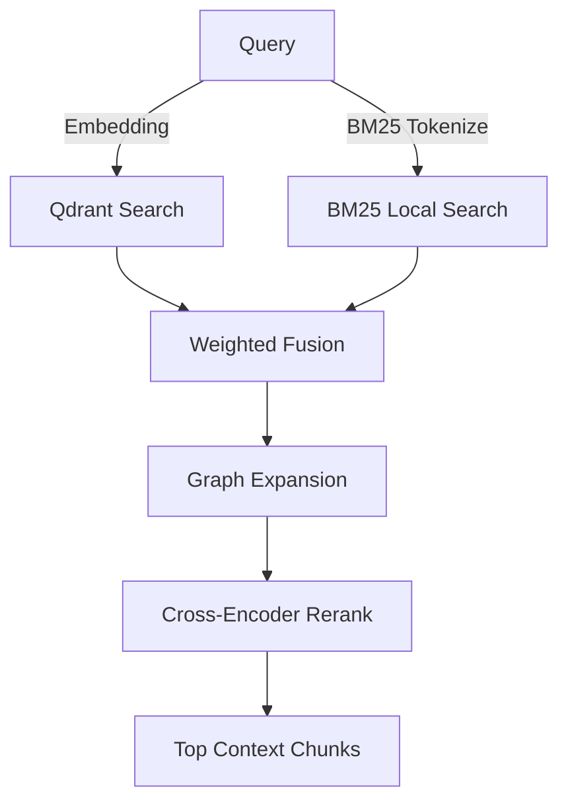

# Retrieval Architecture

Retrieval combines multiple indexing strategies into a single hybrid ranker.

## Retrieval Components
1. **Dense Retrieval**: Match embeddings against Qdrant collections (`scaleflow_paragraphs` / `scaleflow_tables`).
2. **Sparse Retrieval**: BM25 keyword matching.
3. **Graph Expansion**: Fetches immediate semantic neighbors of retrieved chunks using graph adjacency lists.
4. **Reranking**: Scores candidates using a Cross-Encoder (`ms-marco-MiniLM-L-6-v2`).\n