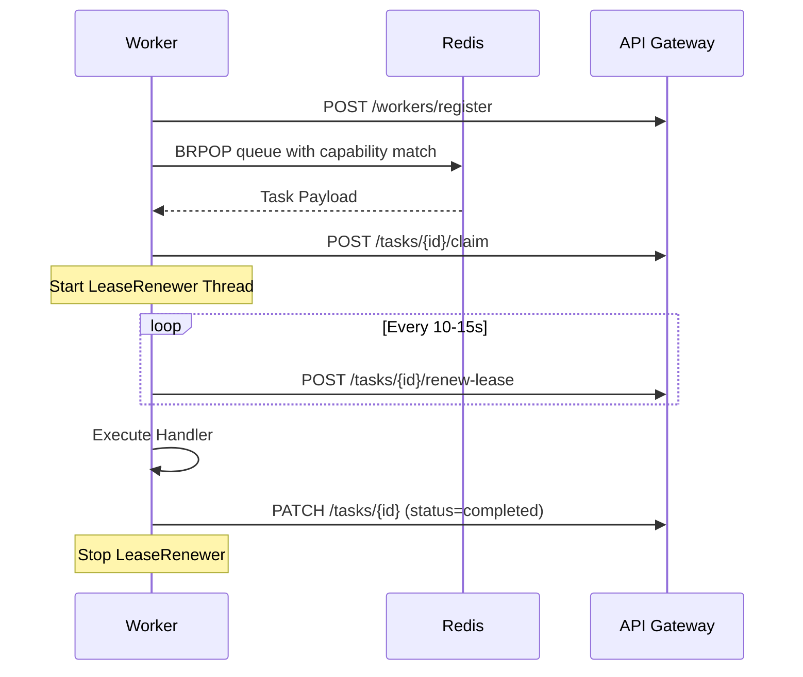

# Worker Architecture

ScaleFlow uses a custom polling consumer model (non-Celery) communicating through Redis and HTTP API.

## Worker Lifecycle

## Lease Management & Heartbeats
- **Lease Duration**: Est. Runtime * LEASE_MULTIPLIER (3.0). Explicit overrides are defined per task (e.g., embedding=900s, parsing=600s).
- **LeaseRenewer Thread**: Runs in background during task execution. Extends lease using `/tasks/{task_id}/renew-lease`.
- **Heartbeats**: Workers ping `/workers/heartbeat` every `WORKER_HEARTBEAT_SECONDS` (10s).
- **Concurrency**: Governed by backend slots (Gemini rate manager) and local worker thread pools.\n