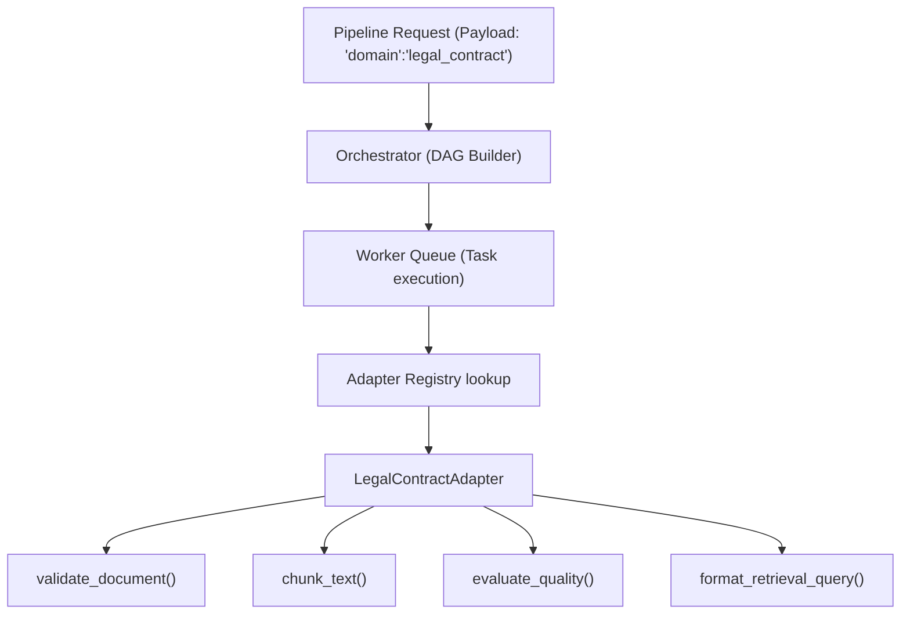

# Domain Adapter Interface Design Document

This document outlines the architectural pattern for pluggable domain-specific adapters in ScaleFlow. The objective is to allow domain experts to customize document parsing validation, chunking strategies, retrieval prompts, and quality gate evaluations without making any edits to the core orchestration code or database models.

---

## 1. Abstract Adapter Interface

Future adapters will inherit from a base `BaseDomainAdapter` class. This interface guarantees standard inputs and outputs, allowing the worker nodes to dynamically invoke the active adapter using a registry pattern.

```python
from abc import ABC, abstractmethod

class BaseDomainAdapter(ABC):
    @property
    @abstractmethod
    def domain_name(self) -> str:
        """Returns the unique identifier for the domain (e.g., 'research_paper', 'legal_contract')."""
        pass

    @abstractmethod
    def validate_document(self, file_path: str, metadata: dict) -> tuple[bool, str]:
        """
        Validate the document structure, size, or metadata before ingestion.
        Returns (is_valid, error_message).
        """
        pass

    @abstractmethod
    def chunk_text(self, text: str) -> list[str]:
        """
        Apply domain-specific text chunking rules (e.g. section-based chunking for legal or paragraph-based for books).
        """
        pass

    @abstractmethod
    def evaluate_quality(self, text: str, parse_stats: dict) -> dict:
        """
        Perform domain-specific text quality verification.
        Returns a dict of quality metrics. Raises ValueError if quality thresholds fail.
        """
        pass

    @abstractmethod
    def format_retrieval_query(self, query: str) -> str:
        """
        Reformat query or apply domain-specific prompts or system templates before vector retrieval.
        """
        pass
```

---

## 2. Pluggable Architecture

Plugging in a new adapter (e.g., `ResearchPaperAdapter` or `LegalContractAdapter`) is accomplished by:
1. Creating a new subclass of `BaseDomainAdapter` inside a `backend/adapters/` directory.
2. Registering the new adapter in an `ADAPTER_REGISTRY` mapping.
3. Specifying the target domain adapter in the pipeline creation payload (e.g. `{"domain": "legal_contract"}`). The orchestrator passes this parameter to the tasks, and worker nodes load the respective adapter dynamically.



---

## 3. Example Implementations

### ResearchPaperAdapter
* **validate_document()**: Verifies that the PDF has an abstract section and a references section.
* **chunk_text()**: Chunk sizes of 400-500 words, heading-aware (splitting fresh chunks at sections like Introduction, Methods, Results).
* **evaluate_quality()**: Checks for presence of bibliography keywords (e.g., "et al.", "proceedings", "journal").
* **format_retrieval_query()**: Rewrites queries to include research context: *"Based on the methodology of this paper, answer: [query]"*.

### LegalContractAdapter
* **validate_document()**: Validates that standard signature pages or clause formatting is present.
* **chunk_text()**: Sentence-based chunking, splitting precisely on numbered sections/articles (e.g. Section 1.1, Article II) to prevent contract terms from being sliced mid-clause.
* **evaluate_quality()**: Requires high printable character ratio (98%+) since legal text must be OCR-perfect.
* **format_retrieval_query()**: Templates the query: *"According to the definitions and provisions in this agreement, detail: [query]"*.

---

## 4. Orchestration Separation

By maintaining this boundary, the main scheduler and DAG runtime remain entirely agnostic of these actions. The orchestrator only schedules task steps: `parse_document` → `validate_parse_quality` → `chunk_text` → `generate_embeddings`. The tasks load and invoke the domain-specific adapters dynamically, keeping the pipeline runtime highly reusable.
