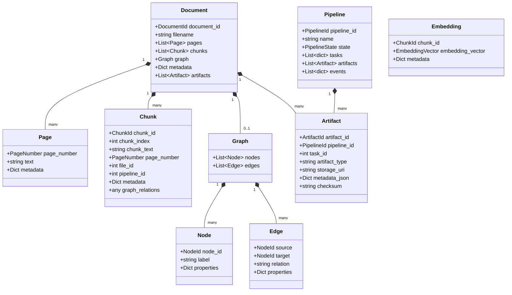

# Domain Model Specification

This document details the pure Python domain model implemented for Phase 2 of the ScaleFlow architecture refactor.

## Domain Model Hierarchy

## Value Objects

Value objects enforce domain boundaries by replacing raw types (primitives) with validated, immutable components:

- **`DocumentId`**: Integer > 0 representing a unique document.
- **`PipelineId`**: Integer > 0 representing a unique pipeline.
- **`ArtifactId`**: Integer > 0 representing a unique artifact.
- **`ChunkId`**: Non-empty string representing a unique chunk identifier.
- **`NodeId`**: Non-empty string representing a graph node.
- **`PageNumber`**: Non-negative integer.
- **`BoundingBox`**: Coordinates `x0, y0, x1, y1` defining box bounds.
- **`Coordinates`**: `x, y` position floats.
- **`EmbeddingVector`**: List of float numbers representing a generated vector.
