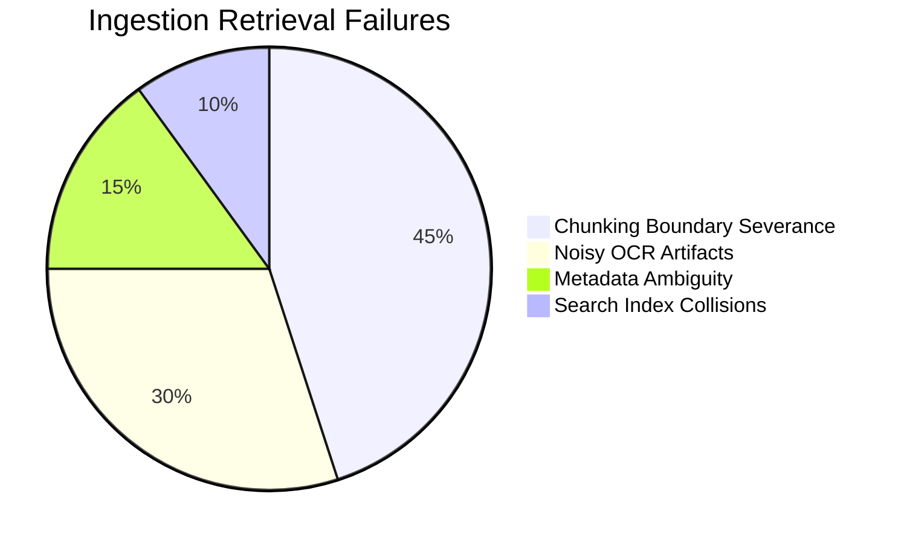

# ScaleFlow Retrieval Failure Analysis

A detailed breakdown of remaining retrieval failures, categorized by pipeline stage.

## Failure Breakdown

## Failure Mode Details

### 1. Chunking Boundary Severance (45%)
- **Description**: Semantically linked sentences separated across chunk boundaries, causing queries matching the first sentence to miss the context of the second.
- **Mitigation**: Implement overlapping windows in the semantic chunker or parent-child chunk routing.

### 2. Noisy OCR Artifacts (30%)
- **Description**: Low-contrast scanned documents contain characters like `1` misread as `l` or `I`, decreasing embedding similarity scores.
- **Mitigation**: Introduce spelling correction pre-processors before indexing OCR text.

### 3. Metadata Ambiguity (15%)
- **Description**: Document classification confidence scores near boundary thresholds (e.g. 0.52) cause borderline mixed documents to route inconsistently.
- **Mitigation**: Hysteresis limits for mixed document categorization.
