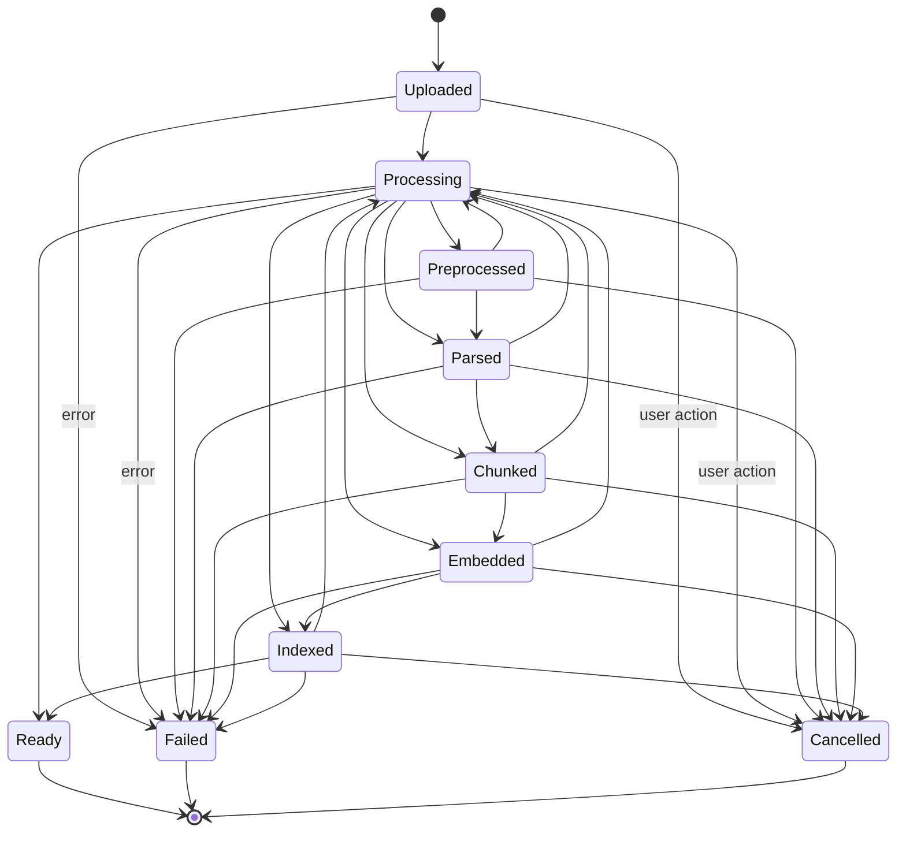

# State Machine Specification

This document defines the Pipeline State Machine, representing the complete lifecycle of document processing pipelines.

## State Transitions Diagram

## Transition Validation

- State transitions are validated by `backend/domain/states.py`.
- Attempting illegal state transitions raises `InvalidTransition` (inherits from `DomainException`).
